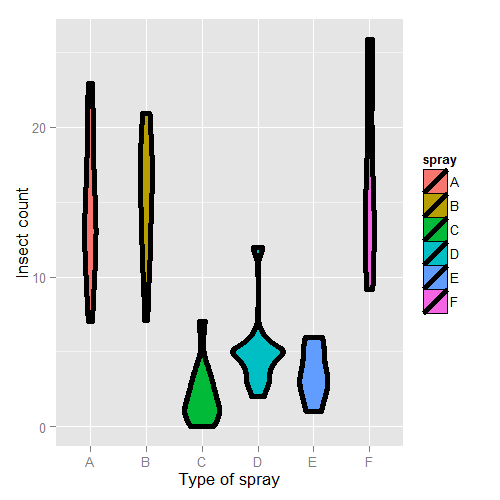

# Multivariate

In this chapter we cover a few examples of multivariate regression in order
to get a hands on sense of the basics.

## Data set for discussion

We'll  start with the `Swiss` dataset that is part of the
`datasets` package. This can be loaded in R with:

{lang=r,line-numbers=off}
~~~
> require(datasets); data(swiss); ?swiss
~~~

Standardized fertility measure and socio-economic indicators for each of 47
French-speaking provinces of Switzerland at about 1888.

A data frame with 47 observations on 6 variables, each of which is in percent,
i.e., in [0, 100].

{lang=r,line-numbers=off}
~~~
[,1]   Fertility          a common standardized fertility measure
[,2]   Agriculture        percent of males involved in agriculture as occupation
[,3]	 Examination        percent draftees receiving highest mark on army examination
[,4]	 Education          percent education beyond primary school for draftees
[,5]	 Catholic           percent catholic (as opposed to protestant)
[,6]	 Infant.Mortality   live births who live less than 1 year
~~~

All variables but Fertility give percentages of the population.


Let's see the result of calling `lm` on this data set.

{lang=r,line-numbers=off}
~~~
> summary(lm(Fertility ~ . , data = swiss))
                 Estimate Std. Error t value  Pr(>|t|)
(Intercept)       66.9152   10.70604   6.250 1.906e-07
Agriculture       -0.1721    0.07030  -2.448 1.873e-02
Examination       -0.2580    0.25388  -1.016 3.155e-01
Education         -0.8709    0.18303  -4.758 2.431e-05
Catholic           0.1041    0.03526   2.953 5.190e-03
Infant.Mortality   1.0770    0.38172   2.822 7.336e-03
~~~

Agriculture is expressed in percentages (0 - 100), representing the percentage
of the male population involved in agriculture.  
The regression slope estimate for this variable is `-0.1721`. We interpret
this coefficients as follows:

Our models estimates an expected 0.17 decrease in standardized fertility for every 1% increase in percentage of males involved in agriculture in holding the remaining variables constant.

Note that the the t-test for $H_0: \beta_{Agri} = 0$ versus
$H_a: \beta_{Agri} \neq 0$ is  significant since `0.0187` is less
that typical benchmarks (0.05, for exaple). Note that, by default, R is
reporting the P-value for the two sided test. If you want the one sided test,
calculate it directly using the T-statistic and the degrees of freedom.
(You can figure it out from the two sided P-value, but it's easy to get tripped
up with signs.)

Interestingly, the unadjusted estimate is

{lang=r,line-numbers=off}
~~~
summary(lm(Fertility ~ Agriculture, data = swiss))$coefficients
            Estimate Std. Error t value  Pr(>|t|)
(Intercept)  60.3044    4.25126  14.185 3.216e-18
Agriculture   0.1942    0.07671   2.532 1.492e-02
~~~

Notice that the sign of the slope estimate reversed! This is an
example of so-called "Simpson's Paradox". This purported paradox (which is actually not
a paradox at all) simply points out that unadjusted and adjusted effects can
be the reverse of each other. Or in other words, the apparent relationship between X and Y may
change if we account for Z.  Let's explore multivariate adjustment and
sign reversals with simulation.

## Simulation study

Below we simulate 100 random variables with a linear relationship between X1, X2 and Y.
Notably, we generate X1 as a linear function of X2. In this simulation, X1 has a negative
adjusted effect on Y while X2 has a positive adjusted effect (adjusted referring to the effect
including both variables). However, X1 is related to X2. Notice our unadjusted effect of
X1 is of the opposite sign (and way off), while the adjusted one is about right. What's happening?
Our unadjusted model is picking up the effect X2 as as it's represented in X1. Play around
with the generating coefficients to see how you can make the estimated relationships very
different than the generating ones. More than anything, this illustrates that multivariate
modeling is hard stuff.

{lang=r,line-numbers=off}
~~~
> n = 100; x2 <- 1 : n; x1 = .01 * x2 + runif(n, -.1, .1); y = -x1 + x2 + rnorm(n, sd = .01)
> summary(lm(y ~ x1))$coef

            Estimate Std. Error t value  Pr(>|t|)
(Intercept)    1.454      1.079   1.348 1.807e-01
x1            96.793      1.862  51.985 3.707e-73
>summary(lm(y ~ x1 + x2))$coef
             Estimate Std. Error  t value   Pr(>|t|)
(Intercept)  0.001933  0.0017709    1.092  2.777e-01
x1          -1.020506  0.0163560  -62.393  4.211e-80
x2           1.000133  0.0001643 6085.554 1.544e-272
~~~

To confirm what's going on, let's look at some plots. In the left
panel, we plot Y versus X1. Notice the positive relationship. However,
if we look at X2 (the color) notice that it clearly goes up with Y
as well. If we adjust both the X1 and Y variable by taking the
residual after having regressed X2, we get the actual correct
relationship between X1 and Y.


## Back to this data set
In our data set, the sign reverses itself with the inclusion of Examination and Education. However, the percent of males in the province working in agriculture is negatively related to educational attainment (correlation of -0.6395) and Education and Examination (correlation of 0.6984) are obviously measuring similar things.

So, given now that we know including correlated variables with our variable
of interest into our regression relationship can drastically change things
we have to ask: "Is the positive marginal an artifact for not having accounted for, say, Education level? (Education does have a stronger effect, by the way.)" At the minimum, anyone claiming that provinces that are more agricultural have higher fertility rates would immediately be open to criticism that the real effect is due to Education levels.

You might think then, why don't I just always include all variables
that I have into my regression model to avoid incorrectly adjusted effects?
Of course, it's not this easy and there's negative consequences to
including variables unnecessarily. We'll talk more about model building
and the process of choosing which variables to include or not in the
next chapter.

## What if we include a completely unnecessary variable?
Next chapter we'll discuss working with a collection of
correlated predictors. But you might wonder, what happens
if you include a predictor that's completely unnecessary.
Let's try some computer experiments with our fertility data.
In the code below,
z adds no new linear information, since it's a linear
combination of variables already included. R just drops
terms that are linear combinations of other terms.

{lang=r,line-numbers=off}
~~~
> z <- swiss$Agriculture + swiss$Education
lm(Fertility ~ . + z, data = swiss)\
> Call:
lm(formula = Fertility ~ . + z, data = swiss)

Coefficients:
     (Intercept)       Agriculture       Examination         Education          Catholic  
          66.915            -0.172            -0.258            -0.871             0.104  
Infant.Mortality                 z  
           1.077                NA  
~~~

This is a fundamental point of multivariate regression: regression
models fit the linear space of the regressors. Therefore, any linear
reorganization of the regressors will result in an equivalent fit,
with different covariates of course. However, the percentage of
the variance explained in the response will be constant. It is only
through adding variables that are not perfectly explained by the
existing ones that one can explain more variation in the response.
So, for example, models with covariates i) X and Z, ii) X+Z and X-Z and
iii) 2X and 4Z will
all explain the same amount of variation in Y. A third variable, W say,
will only explain more variation in Y if it's not perfectly explained
by X and Z. R lets you know when you've done this by putting redundant
variables as having NA coefficients.

## Dummy variables are smart
It is interesting to note that models with
factor variables as predictors are simply special cases of regression
models.  As an example, consider the linear model:

{$$}
Y_i = \beta_0 + X_{i1} \beta_1 + \epsilon_{i}
{/$$}

where each {$$}X_{i1}{/$$} is binary so that it is a 1 if measurement
{$$}i{/$$} is in a group and 0 otherwise. As an example, consider
a variable as treated versus not in a clinical trial. Or, in a more
data science context, consider an A/B test comparing two ad campaigns
where Y is the click through rate.

Refer back to our model. For people in the group {$$}E[Y_i] = \beta_0 + \beta_1{/$$}
and for people not in the group {$$}E[Y_i] = \beta_0{/$$}.
The least squares fits work out to be
{$$}\hat \beta_0 + \hat \beta_1{/$$} is the mean for those in the group and {$$}\hat \beta_0{/$$}
is the mean for those not in the group.
The variable {$$}\beta_1{/$$} is interpreted as the increase or decrease in the mean comparing those in the group to those not.
The T-test for that coefficient is exactly the two group T test with a common variance.

Finally, note including a binary variable that is 1 for those not in the group would be redundant,
it would create three parameters to describe two means. Moreover, we know from the last section that
including redundant variables will result in R just setting one of them to NA. We know that the intercept
column is a column of ones, the group variable is one for those in the group while a variable for
those not in the group would just be the subtraction of these two. Thus, it's linearly redundant and unnecessary.

## More than 2 levels
Consider a multilevel factor level. For didactic reasons, let's say a three level factor. As an example
consider a variable for US political party affiliation: Republican, Democrat, Independent/other. Let's use the model:

{$$}Y_i = \beta_0 + X_{i1} \beta_1 + X_{i2} \beta_2 + \epsilon_i.{/$$}

Here the variable {$$}X_{i1}{/$$} is 1 for Republicans and 0 otherwise,
the variab1e {$$}X_{i2}{/$$} is 1 for Democrats and 0 otherwise. As before, we don't
need an {$$}X_{i3}{/$$} for Independent/Other, since it would be redundant.

So now consider the implications of more model. If person
{$$}i{/$$} is Republican then {$$}E[Y_i] = \beta_0 +\beta_1{/$$}. On the other hand,
If person {$$}i{/$$} is Democrat then {$$}E[Y_i] = \beta_0 + \beta_2{/$$}.
Finally, If $i$ is Independent/Other {$$}E[Y_i] = \beta_0{/$$}.

So, we can interpret our coefficients as follows.
{$$}\beta_1{/$$} compares the mean for Republicans to that of Independents/Others.
{$$}\beta_2{/$$} compares the mean for Democrats to that of Independents/Others.
{$$}\beta_1 - \beta_2{/$$} compares the mean for Republicans to that of Democrats.
Notice the coefficients are all comparisons to the category that we left out, Independents/Others.
If one category is an obvious reference category, chose that one to leave our.
In R, if our variable is a factor variable, it will create the dummy variables for us and pick one of the
levels to be the reference level. Let's go through an example to see.


## Insect Sprays

Let's consider a model with factors. Consider the `InsectSprays` dataset in R. The data
models the number of dead insects from different pesticides. Since it's not clear from the documentation,
let's assume (probably accurately)
that these were annoying bad insects, like fleas, mosquitoes or cockroaches, and not good ones like butterflies
or ladybugs. After getting over that mental hurdle, let's plot the data.

require(datasets);data(InsectSprays); require(stats); require(ggplot2)
{lang=r,line-numbers=off}
~~~
g = ggplot(data = InsectSprays, aes(y = count, x = spray, fill  = spray))
g = g + geom_violin(colour = "black", size = 2)
g = g + xlab("Type of spray") + ylab("Insect count")
g
~~~

Here's the plot. There's probably better ways to model this data, but let's use a
linear model just to illustrate factor variables.




First, let's set Spray A as the reference (the default, since it has the lowest alphanumeric factor level).

{lang=r,line-numbers=off}
~~~
> summary(lm(count ~ spray, data = InsectSprays))$coef
            Estimate Std. Error t value  Pr(>|t|)
(Intercept)  14.5000      1.132 12.8074 1.471e-19
sprayB        0.8333      1.601  0.5205 6.045e-01
sprayC      -12.4167      1.601 -7.7550 7.267e-11
sprayD       -9.5833      1.601 -5.9854 9.817e-08
sprayE      -11.0000      1.601 -6.8702 2.754e-09
sprayF        2.1667      1.601  1.3532 1.806e-01
~~~

Therefore, 0.8333 is the estimated mean comparing Spray B to Spray A (as B - A),
-12.4167 compares Spray C to Spray A (as C - A) and so on. The inferencial statistics: standard
errors, t value and P-value all correspond to those comparisons. The intercept, 14.5, is the
mean for Spray A. So, its inferential statistics are testing whether or not the mean for
Spray A is zero. As is often the case, this test isn't terribly informative and often yields
extremely small statistics (since we know the spray kills some bugs). The estimated mean for Spray B
is its effect plus the intercept (14.5 + 0.8333); the estimated mean for Spray C is 14.5 - 12.4167 (its
  effect plus the intercept) and so on for the rest of the factor levels.

Let's hard code the factor levels so we can directly see what's going on. Remember, we simply
leave out the dummy variable for the reference level.

{lang=r,line-numbers=off}
~~~
> summary(lm(count ~
             I(1 * (spray == 'B')) + I(1 * (spray == 'C')) +
             I(1 * (spray == 'D')) + I(1 * (spray == 'E')) +
             I(1 * (spray == 'F'))
           , data = InsectSprays))$coef
                      Estimate Std. Error t value  Pr(>|t|)
(Intercept)            14.5000      1.132 12.8074 1.471e-19
I(1 * (spray == "B"))   0.8333      1.601  0.5205 6.045e-01
I(1 * (spray == "C")) -12.4167      1.601 -7.7550 7.267e-11
I(1 * (spray == "D"))  -9.5833      1.601 -5.9854 9.817e-08
I(1 * (spray == "E")) -11.0000      1.601 -6.8702 2.754e-09
I(1 * (spray == "F"))   2.1667      1.601  1.3532 1.806e-01
~~~

Of course, it's identical.  You might further ask yourself, what would
happen if I included a dummy variable for Spray A? Would the world implode?
No, it just realizes that one of the dummy variables is redundant and drops
it.

{lang=r,line-numbers=off}
~~~
> summary(lm(count ~
   I(1 * (spray == 'B')) + I(1 * (spray == 'C')) +  
   I(1 * (spray == 'D')) + I(1 * (spray == 'E')) +
   I(1 * (spray == 'F')) + I(1 * (spray == 'A')), data = InsectSprays))$coef

                      Estimate Std. Error t value  Pr(>|t|)
(Intercept)            14.5000      1.132 12.8074 1.471e-19
I(1 * (spray == "B"))   0.8333      1.601  0.5205 6.045e-01
I(1 * (spray == "C")) -12.4167      1.601 -7.7550 7.267e-11
I(1 * (spray == "D"))  -9.5833      1.601 -5.9854 9.817e-08
I(1 * (spray == "E")) -11.0000      1.601 -6.8702 2.754e-09
I(1 * (spray == "F"))   2.1667      1.601  1.3532 1.806e-01
~~~

However, if we drop the intercept, then the Spray A term is
no longer redundant. The each coefficient is the mean for
that Spray.

{lang=r,line-numbers=off}
~~~
> summary(lm(count ~ spray - 1, data = InsectSprays))$coef
       Estimate Std. Error t value  Pr(>|t|)

sprayA   14.500      1.132  12.807 1.471e-19
sprayB   15.333      1.132  13.543 1.002e-20
sprayC    2.083      1.132   1.840 7.024e-02
sprayD    4.917      1.132   4.343 4.953e-05
sprayE    3.500      1.132   3.091 2.917e-03
sprayF   16.667      1.132  14.721 1.573e-22
~~~

So, for example, 14.5 is the mean for Spray A (as we already knew),
15.33 is the mean for Spray B (14.5 + 0.8333 from our previous model formulation),
2.083 is the mean for Spray C (14.5 - 12.4167 from our previous model formluation) and so on.
This is a nice trick if you want your model formulated in the terms of the group means,
rather than the group comparisons relative to the reference group.

Also, if there's no other covariates, the estimated coefficients for this mode are
exactly the empirical means of the groups. We can use dplyr to check this really
easily and grab the mean for each group.

{lang=r,line-numbers=off}
~~~
> library(dplyr)
> summarise(group_by(InsectSprays, spray), mn = mean(count))
Source: local data frame [6 x 2]

  spray     mn
1     A 14.500
2     B 15.333
3     C  2.083
4     D  4.917
5     E  3.500
6     F 16.667
~~~

Often your lowest alphanumeric level isn't the level that you're most
interested in as a reference group. There's an easy fix for that with
factor variables; use the `relevel` function. Here we give a simple
example. We created a variable `spray2` that has Spray C as the reference
level.

{lang=r,line-numbers=off}
> spray2 <- relevel(InsectSprays$spray, "C")
~~~
> summary(lm(count ~ spray2, data = InsectSprays))$coef
            Estimate Std. Error t value  Pr(>|t|)
(Intercept)    2.083      1.132  1.8401 7.024e-02
spray2A       12.417      1.601  7.7550 7.267e-11
spray2B       13.250      1.601  8.2755 8.510e-12
spray2D        2.833      1.601  1.7696 8.141e-02
spray2E        1.417      1.601  0.8848 3.795e-01
spray2F       14.583      1.601  9.1083 2.794e-13
~~~

Now the intercept is the mean for Spray C and all of the coefficients are interpreted
with respect to Spray C. So, 12.417 is the comparison between Spray A and Spray C (as A - C)
and so on.


### Summary of dummy variables
If you haven't seen this before, it might seem rather strange. However, it's essential to understand how
dummy variables are treated, as otherwise huge interpretation errors can be made. Here we give a brief bullet summary
of dummy variables to help solidify this information.

* If we treat a variable as a factor, R includes an intercept and omits the alphabetically first level of the factor.
  * The intercept is the estimated mean for the reference level.
  * The intercept t-test tests for whether or not the mean for the reference level is 0.
  * All other t-tests are for comparisons of the other levels versus the reference level.
  * Other group means are obtained the intercept plus their coefficient.
* If we omit an intercept, then it includes terms for all levels of the factor.
  * Group means are now the coefficients.
  * Tests are tests of whether the groups are different than zero.
* If we want comparisons between two levels, neither of which is the reference level, we could refit the model with one of them as the reference level.

### Other thoughts on this data
We don't suggest that this is in anyway a thorough analysis of this data. For example,
the data are counts which are bounded from below by 0. This clearly violates the assumption of normality of the errors.
Also there are counts near zero, so both the actual assumption and the intent of this assumption are violated.
Furthermore, the variance does not appear to be constant (look back at the violin plots).
Perhaps taking logs of the counts would help. But, since there are 0 counts, maybe log(Count + 1).
Also, we'll cover Poisson GLMs for fitting count data.


## Further analysis of the `swiss` dataset

Let's create some dummy variables in the `swiss` dataset to illustrate them in a more
multivariable context. Just to remind ourselves of the dataset, here's the first few
rows.

{lang=r,line-numbers=off}
> spray2 <- relevel(InsectSprays$spray, "C")
~~~
> library(datasets); data(swiss)
> head(swiss)

             Fertility Agriculture Examination Education Catholic Infant.Mortality
Courtelary        80.2        17.0          15        12     9.96             22.2
Delemont          83.1        45.1           6         9    84.84             22.2
Franches-Mnt      92.5        39.7           5         5    93.40             20.2
Moutier           85.8        36.5          12         7    33.77             20.3
Neuveville        76.9        43.5          17        15     5.16             20.6
Porrentruy        76.1        35.3           9         7    90.57             26.6
~~~

Let's create a  binary variable out of the variable Catholic to illustrate dummy
variables in multivariable models. However, it should be noted that this isn't
patently absurd, since the variable is highly bimodal anyway. Let's just split
at majority Catholic or not:

{lang=r,line-numbers=off}
> spray2 <- relevel(InsectSprays$spray, "C")
~~~
library(dplyr);
swiss = mutate(swiss, CatholicBin = 1 * (Catholic > 50))
~~~

Since we're interested in Agriculture as a variable and Fertility as an outcome, let's plot
those two color coded by the binary Catholic variable:

{lang=r,line-numbers=off}
~~~
g = ggplot(swiss, aes(x = Agriculture, y = Fertility, colour = factor(CatholicBin)))
g = g + geom_point(size = 6, colour = "black") + geom_point(size = 4)
g = g + xlab("% in Agriculture") + ylab("Fertility")
g
~~~


Our model is:

{$$}Y_i = \beta_0 + X_{i1} \beta_1 + X_{i2} \beta_2 + \epsilon_i{/$$}

where {$$}Y_i{/$$} is `Fertility`, {$$}X_{i1}{/$$} is '`Agriculture` and
{$$}X_{i2}{/$$} is `CatholicBin`. Let's first fit the model with {$$}X_{i2}{/$$}
removed:

{lang=r,line-numbers=off}
~~~
> summary(lm(Fertility ~ Agriculture, data = swiss))$coef

            Estimate Std. Error t value  Pr(>|t|)
(Intercept)  60.3044    4.25126  14.185 3.216e-18
Agriculture   0.1942    0.07671   2.532 1.492e-02
~~~

<!--

---
## Parallel lines

```r
summary(lm(Fertility ~ Agriculture + factor(CatholicBin), data = swiss))$coef
```

```
                     Estimate Std. Error t value  Pr(>|t|)
(Intercept)           60.8322     4.1059  14.816 1.032e-18
Agriculture            0.1242     0.0811   1.531 1.329e-01
factor(CatholicBin)1   7.8843     3.7484   2.103 4.118e-02
```


---
## Lines with different slopes and intercepts

```r
summary(lm(Fertility ~ Agriculture * factor(CatholicBin), data = swiss))$coef
```

```
                                 Estimate Std. Error t value  Pr(>|t|)
(Intercept)                      62.04993    4.78916 12.9563 1.919e-16
Agriculture                       0.09612    0.09881  0.9727 3.361e-01
factor(CatholicBin)1              2.85770   10.62644  0.2689 7.893e-01
Agriculture:factor(CatholicBin)1  0.08914    0.17611  0.5061 6.153e-01
```


---
## Just to show you it can be done

```r
summary(lm(Fertility ~ Agriculture + Agriculture : factor(CatholicBin), data = swiss))$coef
```

```
                                 Estimate Std. Error t value  Pr(>|t|)
(Intercept)                      62.63037    4.22989 14.8066 1.057e-18
Agriculture                       0.08539    0.08945  0.9546 3.450e-01
Agriculture:factor(CatholicBin)1  0.13340    0.06199  2.1520 3.693e-02
```
-->
