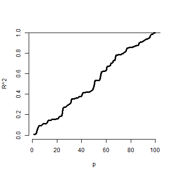

# Multiple variables and model selection
[Watch this video before beginning.](https://youtu.be/zfhNo8uNBho?list=PLpl-gQkQivXjqHAJd2t-J_One_fYE55tC)

This chapter represents a challenging question: "How do we chose what
to variables to include in a regression model?". Sadly, no single easy
answer exists and the most reasonable answer would be "It depends.".
These concepts bleed into ideas of machine learning, which is largely
focused on high dimensional variable selection and weighting.  In this
chapter we cover some of the basics and, most importantly, the
consequences of over- and under-fitting a model.

## Multivariable regression 

In our Coursera Data Science Specialization, we have an entire class
on prediction and machine learning.  So, in this class, our focus will
be on modeling. That is, our primary concern is winding up with an
interpretable model, with interpretable coefficients. This is a very
different process than if we only care about prediction or machine
learning.  Prediction has a different set of criteria, needs for
interpretability and standards for generalizability.  In modeling, our
interest lies in parsimonious, interpretable representations of the
data that enhance our understanding of the phenomena under study.

Like nearly all aspects of statistics, good modeling decisions are
context dependent. Consider a good model for prediction, versus one
for studying mechanisms, versus one for trying to establish causal
effects.  There are, however, some principles to help you guide your
way.

*Parsimony* is a core concept in model selection. The idea of
parsimony is to keep your models as simple as possible (but no
simpler). This builds on the idea of [Occam's
razor](https://en.wikipedia.org/wiki/Occam's_razor), in that all else
being equal simpler explanations are better than complex ones. Simpler
models are easier to interpret and are less finicky. Complex models
often have issues with fitting and, especially, overfitting.  ([To see
a counterargument, consider Andrew Gelman's
blog.](http://andrewgelman.com/2004/12/10/against_parsimo/).)

Another principle that I find useful for looking at statistical models
is to consider them as lenses through which to look at your data. (I
attribute this quote to the great statistician Scott Zeger.) Under
this philosophy, what's the right model - whatever one connects the
data to a true, parsimonious statement about what you're
studying. Unwin and authors have formalized these ideas more into
something they call [exploratory model
analysis](http://www.sciencedirect.com/science/article/pii/S016794730200292X)
I like this, as it turns our focus away from trying to get a single,
best, true model and instead focuses on utilizing models as ways to
probe data.  This is useful, since all models are wrong in some fashion.  
Keep this in mind as we focus on variable inclusion and exclusion in this chapter.

## The Rumsfeldian triplet

Before we begin, I'd like to give a quote from Donald Rumsfeld, the
controversial Secretary of Defense of the US during the start of the
Afghanistan and second Iraq wars. He gave this quote regarding weapons
of mass destruction ([read more about it
here](https://en.wikipedia.org/wiki/There_are_known_knowns)):

"There are known knowns. These are things we know that we know. There
are known unknowns. That is to say, there are things that we know we
don't know. But there are also unknown unknowns. There are things we
don't know we don't know." - Donald Rumsfeld

This quote, widely derided for its intended purpose, is quite
insightful in the unintended context of regression model
selection. Specifically, in our context "Known Knowns" are regressors
that we know we should check for inclusion in the model.  The
"Known Unknowns" are regressors that we would like to include in the
model, but don't have.  The "Unknown Unknowns" are regressors that we
don't even know about that we should have included in the model.

In this chapter, we'll talk about Known Knowns; variables that are
potentially of interest in our model that we have.  Known Unknowns and
Unknown Unknowns (especially) are more challenging to deal with. A
central method for dealing with Unknown Unknowns is randomization. If
you'd like to compare a treatment to a control, or perform an A/B test
of two advertising strategies, randomization will help insure that
your treatment is balanced across levels of the Unknown Unknowns with
high probability. (Of course, being unobserved, you can never know
whether or not the randomization was effective.)

For Known Unknowns, those variables we wish we had collected but did
not, there are several strategies.  For example, a proxy variable
might be of use. As an example, we had some brain volumetric
measurements via MRIs and really wished we had done the processing to
get intra-cranial volume (head size). The need for this variable was
because we didn't want to compare brain volumetric measurements and
conclude that bigger people with bigger heads have more brain
mass. This would be a useless conclusion. For example, killer whales
have bigger brains than dolphins, but that doesn't tell you much about
killer whales or dolphins. More interesting would be if killer whales
who were exposed to toxic chemicals had lower brain volume relative to
their intra-cranial volume than whales who weren't. In our case, (we
were studying humans), we used height, gender and other
anthropomorphic measurements to get a good guess of intra-cranial
volume.

For the rest of the lecture, let's discuss the known knowns and what
their unnecessary inclusion and exclusion implies in our analysis.

## General rules
Here we state a couple of general rules regarding model selection for our known knowns.

* Omitting variables results in bias in the coefficients of interest - unless the regressors are uncorrelated with the omitted ones.

I want to reiterate this point: if the omitted variable is uncorrelated with the included variables, its omission has no impact
on estimation. It might explain some residual variation, thus it could have an impact on inference.
As previously mentioned, this lack of impact of uncorrelated variables is why we randomize treatments;
randomization attempts to disassociate our treatment indicator with variables that we don't have to put in the model. Formal
theories of inference can be designed around the use of randomization.  However,
in a practical sense, if there's too many unobserved confounding variables, even randomization won't help you, since
with high probability one will stay correlated with the treatment.

In most cases we won't have randomization. So, to avoid bias, why don't we throw everything into the regression model?
The following rule prevents us from doing that:

* Including variables that we shouldn't have increases standard errors of the regression variables.

Actually, including any new variables increases the actual (not estimated) standard errors of other regressors.
So we don't want to idly throw variables into the model. In addition the model must tend toward perfect
fit as the number of non-redundant regressors approaches the sample size.  Our {$$}R^2{/$$}
increases monotonically as more regressors are included, even unrelated white noise.

## R squared goes up as you put regressors in the model

Let's try a simulation. In this simulation, no regression relationship exists. We simulate data and {$$}p{/$$} regressors as random normals.
The plot is of the {$$}R^2{/$$}.

{lang=r,line-numbers=off}
~~~
n <- 100
plot(c(1, n), 0 : 1, type = "n", frame = FALSE, xlab = "p", ylab = "R^2")
y <- rnorm(n); x <- NULL; r <- NULL
for (i in 1 : n){
   x <- cbind(x, rnorm(n))
   r <- c(r, summary(lm(y ~ x))$r.squared)
}
lines(1 : n, r, lwd = 3)
abline(h = 1)
~~~

Notice that the {$$}R^2{/$$} goes up, monotonically, as the number of regressors
is increased. This reminds us of a couple of things. First, irrelevant variables
explain residual variation by chance. And, when evaluating fit, we have to take
into account the number of regressors included. The adjusted {$$}R^2{/$$} is better
for these purposes than {$$}R^2{/$$} since it accounts for the number of variables
included in the model. In R, you can get the adjusted {$$}R^2{/$$} very easily with
by grabbing `summary(fitted_model)$adj.r.squared` instead of `summary(fitted_model)$r.squared`.

## Simulation demonstrating variance inflation
[Watch this video before beginning.](https://youtu.be/sP5JJlOCNNo?list=PLpl-gQkQivXjqHAJd2t-J_One_fYE55tC)

Now let's use simulation to demonstrate variation inflation. In this case,
we're going to simulate three regressors, x1, x2 and x3. We then repeatedly
generate data from a model, where y only depends on x1. We fit three models,
`y ~ x1`, `y ~ x1 + x2`, and `y ~ x1 + x2 + x3`. We do this over and over
again and look at the standard deviation of the x1 coefficient.

{lang=r, line-numbers=off}
~~~
> n <- 100; nosim <- 1000
> x1 <- rnorm(n); x2 <- rnorm(n); x3 <- rnorm(n);
> betas <- sapply(1 : nosim, function(i){
  y <- x1 + rnorm(n, sd = .3)
  c(coef(lm(y ~ x1))[2],
    coef(lm(y ~ x1 + x2))[2],
    coef(lm(y ~ x1 + x2 + x3))[2])
  })
> round(apply(betas, 1, sd), 5)

     x1      x1      x1
0.02839 0.02872 0.02884
~~~

Notice that the standard error for the x1 coefficient goes up
as more regressors are included (left to right in our vector output). It's important to note that
these are the actual standard errors (obtained by repeatedly simulating
the data). These aren't obtainable in a single dataset since we only get one realization.
The estimated standard errors, the ones we have access to in a data analysis,
may not go up as you include more regressors.

Now let's see if we can make the variance inflation worse.
In this case, I've made x2 and x3 correlated with x1.

{lang=r, line-numbers=off}
~~~
> n <- 100; nosim <- 1000
> x1 <- rnorm(n); x2 <- x1/sqrt(2) + rnorm(n) /sqrt(2)
> x3 <- x1 * 0.95 + rnorm(n) * sqrt(1 - 0.95^2);
> betas <- sapply(1 : nosim, function(i){
  y <- x1 + rnorm(n, sd = .3)
  c(coef(lm(y ~ x1))[2],
    coef(lm(y ~ x1 + x2))[2],
    coef(lm(y ~ x1 + x2 + x3))[2])
})
> round(apply(betas, 1, sd), 5)
     x1      x1      x1
0.03131 0.04270 0.09653
~~~

Notice that the variance inflation goes up quite a bit more.
This is an issue with including variables that are highly correlated
with the ones that we are interested in. In the first simulation,
the regressors were simulated independently, and the variance inflation
wasn't bad. In the second, they were correlated and it was much worse.

## Summary of variance inflation
* Notice variance inflation was much worse when we included a variable that
was highly related to `x1`.
* We don't know {$$}\sigma{/$$}, the residual variance, so we can't know the actual variance inflation amount.
* However, {$$}\sigma{/$$} drops out of the ratio of the standard errors.
Thus, if one sequentially adds variables, one can check the variance (or sd) inflation for including each one.
* When the other regressors are actually orthogonal (correlation 0) to the regressor of interest, then there is no variance inflation.
* The variance inflation factor (VIF) is the increase in the variance for the ith regressor compared to the ideal setting where it is orthogonal to the other regressors.
  * The square root of the VIF is the increase in the sd instead of variance.
* Remember, variance inflation is only part of the picture. We want to include certain variables, even if they dramatically inflate our variance.

Let's revisit our previous simulation to show how one can estimate the relative
increase in variance. Let's simulate a single dataset, and I'll show how to get
the relative increase in variance for including `x2` and `x3`. All you need to do is
take the ratio of the variances for that coefficient. If you don't exactly
understand the code, don't worry. The idea is that we can obtain these from an observed
data set.

{lang=r, line-numbers=off}
~~~
> y <- x1 + rnorm(n, sd = .3)
> a <- summary(lm(y ~ x1))$cov.unscaled[2,2]
> c(summary(lm(y ~ x1 + x2))$cov.unscaled[2,2],
  summary(lm(y~ x1 + x2 + x3))$cov.unscaled[2,2]) / a
[1] 1.895 9.948
~~~

Now let's check it by referring to our previous simulation and see what
the relative variance for `x1` is when including the `x2` and `x2` plus `x3` models.

{lang=r, line-numbers=off}
~~~
> temp <- apply(betas, 1, var); temp[2 : 3] / temp[1]
   x1    x1
1.860 9.506
~~~

Notice that it's the same (about). In other words, from a single observed dataset
we can perfectly estimate the *relative* variance inflation caused by adding a regressor.

## Swiss data revisited

{lang=r, line-numbers=off}
~~~
> data(swiss);
> fit1 <- lm(Fertility ~ Agriculture, data = swiss)
> a <- summary(fit1)$cov.unscaled[2,2]
>fit2 <- update(fit, Fertility ~ Agriculture + Examination)
> fit3 <- update(fit, Fertility ~ Agriculture + Examination + Education)
> c(summary(fit2)$cov.unscaled[2,2],
    summary(fit3)$cov.unscaled[2,2]) / a
[1] 1.892 2.089
~~~

Thus inclusion of Examination increases the variance of the Agriculture effect by 89.2% while
further adding Examination and Education causes a 108.9% increase. Again,
the observed standard errors won't follow these percentages. These are the
increases if we actually knew {$$}\sigma^2{/$$}.

Let's look at the variance inflation factors. These measure how much
variance inflation the variable causes relative to the setting where
it was orthogonal to the other regressors. This is nice because it
has a well contained interpretation within a single model fit. Also,
one doesn't have to do all of the model refitting we did above to
explore variance inflation. So, in general, the VIFs are the most
convenient entity to work with.

{lang=r, line-numbers=off}
~~~
> library(car)
> fit <- lm(Fertility ~ . , data = swiss)
> vif(fit)
     Agriculture      Examination        Education         Catholic Infant.Mortality
           2.284            3.675            2.775            1.937            1.108
> sqrt(vif(fit)) #If you prefer sd inflation
     Agriculture      Examination        Education         Catholic Infant.Mortality
           1.511            1.917            1.666            1.392            1.052
~~~

## Impact of over- and under-fitting on residual variance estimation

[Watch this video before beginning.](https://www.youtube.com/watch?v=Mg6WUKkRiS8&list=PLpl-gQkQivXjqHAJd2t-J_One_fYE55tC&index=32)

Assuming that the model is linear with additive iid errors,
we can mathematically describe the impact of omitting necessary variables or including unnecessary ones. These
two rules follow:

  * If we *underfit* the model, that is omit necessary covariates, the variance estimate is biased.
  * If we correctly, *or overfit*, the model, including all necessary covariates and possibly some unnecessary ones,
    the variance estimate is unbiased. However, the variance *of the variance* is larger if we include unnecessary variables.

These make sense. If we've omitted important variables, we're attributing residual variation that is really systematic
variation explainable by those omitted covariates. Therefore, we would expect a variance estimate that is systematically
off (biased). We would also expect absence of bias when we throw the kitchen sink at the model and include everything (necessary and unnecessary).
However, then our variance estimate is unstable (the variance of the variance estimate is larger).

## Covariate model selection
Ideally, you include only the necessary variables in a regression model.
However, it's impossible to know in practice which ones are necessary
and which ones are not. Thus we have to discuss variable selection a little bit.
Automated covariate selection is a difficult topic. It depends heavily on how rich of a covariate space one wants to explore.
The space of models explodes quickly as you add interactions and polynomial terms.

In the Data Science Specialization prediction class, we'll cover many modern methods for traversing large model spaces for the purposes of
prediction. In addition, principal components or factor analytic models on covariates are often useful for reducing complex covariate spaces.

It should also be noted that careful design can often eliminate the
need for complex model searches at the analyses stage. For example,
randomized designs, randomized block designs, crossover designs, clinical
trials, A/B testing are all examples of designs where randomization,
balance and stratification are used to create data sets that have more
direct analyses. However, control over the design is often limited in
data science.

I'll give my favorite approach for model selection when I'm trying to get a parsimonious explanatory model. (I would use a different strategy
  for prediction.) Given a coefficient that I'm interested in, I like to use covariate adjustment and multiple models to probe that effect to evaluate it for robustness and to see what other covariates knock it out or amplify it.  In other words, if I have an effect, or absence of an effect, that I'd like to
  report, I try to first come up with criticisms of that effect and then use models to try to answer those criticisms.

As an example, if I had a significant effect of lead exposure on brain size I would think about the following criticism. Were the high exposure
people smaller than the low exposure people. To address this, I would consider adding head size (intra-cranial volume). If the lead exposed were
more obese than the non-exposed, I would put a model with body mass index (BMI) included.  This isn't a terribly systematic approach,
but it tends to teach you a lot about the the data as you get your hands dirty. Most importantly, it makes you think hard about the questions
your asking and what are the potential criticisms to your results. Heading those criticisms off at the pass early on is a good idea.

## How to do nested model testing in R

One particular model selection technique is so useful I'll cover it since it likely wouldn't be covered in a machine learning or prediction class.
If the models of interest are nested and without lots of parameters differentiating them,
it's fairly uncontroversial to use nested likelihood ratio tests for model selection. Consider the following example:

{lang=r,line-numbers=off}
~~~
> fit1 <- lm(Fertility ~ Agriculture, data = swiss)
> fit3 <- update(fit, Fertility ~ Agriculture + Examination + Education)
> fit5 <- update(fit, Fertility ~ Agriculture + Examination + Education + Catholic + Infant.Mortality)
> anova(fit1, fit3, fit5)

Analysis of Variance Table

Model 1: Fertility ~ Agriculture
Model 2: Fertility ~ Agriculture + Examination + Education
Model 3: Fertility ~ Agriculture + Examination + Education + Catholic +
    Infant.Mortality
  Res.Df  RSS Df Sum of Sq    F  Pr(>F)
1     45 6283
2     43 3181  2      3102 30.2 8.6e-09 ***
3     41 2105  2      1076 10.5 0.00021 ***
---
Signif. codes:  0 '***' 0.001 '**' 0.01 '*' 0.05 '.' 0.1 ' ' 1
~~~

Notice how the three models I'm interested in are nested. That is, Model 3 contains all of the Model 2 variables which contains all of the Model 1
variables. The P-values are for a test of whether all of the new variables are all zero or not (i.e. whether or not they're necessary). So this model would conclude that all of the added Model 3 terms are necessary over Model 2 and all of the Model 2 terms are necessary over Model 1. So, unless there were some other
compelling reasons, we'd pick Model 3.
Again, you don't want to blindly follow a model selection procedure, but when the models are naturally nested, this is a reasonable approach.

## Exercises
1. Load the dataset `Seatbelts` as part of the `datasets` package via `data(Seatbelts)`. Use
`as.data.frame` to convert the object to a dataframe. Fit a linear model of driver deaths
with `kms`, `PetrolPrice` and `law` as predictors.
2. Perform a model selection exercise to arrive at a final model. [Watch a video solution.](https://www.youtube.com/watch?v=ffu80TAq2zY&list=PLpl-gQkQivXji7JK1OP1qS7zalwUBPrX0&index=46)

 LocalWords:  knowns regressors volumetric MRIs intra
